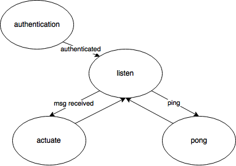

6.S08 Final Project Proposal:

# Twitch Plays Piano

### Hunter Gatewood and Zachary Neely

## I. Introduction

We plan on building a player piano controlled in real time by an online chat. We will use [Twitch](https://en.wikipedia.org/wiki/Twitch.tv) as our chat platform, which has the added benefit of allowing us to stream a video of the piano playing to the chatters, giving them close-to-real-time feedback and incentive to continue using it. Our embedded system will connect to the chat endpoint, parse messages sent by users, and actuate individual keys or combinations of keys based on the parsed messages. (Note that it will **not** stream any video - that will be the responsibility of a dedicated external system.) The embedded system will not require a connection to any external services except the chat endpoint, and will be powered by a USB adapter since the system will require large amounts of power to drive multiple actuators, and is intended to operate autonomously for long periods of time (multiple days). As part of our project's final deliverable, we will perform a power analysis of the system.

Our system could parse many different types of messages, including commands to:

* Play an individual note, chord (multiple notes together), or predefined sequence of notes

* Restrict notes to a certain key or scale

We deliberately do not specify the complete command protocol in this document in order to leave it open to further expansion; however, we will describe a basic command structure which is intended to be easy to remember, descriptive, and quick to type. This project is inspired by [Twitch Plays Pokemón](https://en.wikipedia.org/wiki/Twitch_Plays_Pok%C3%A9mon), a massively popular online experiment in which the same chat and video streaming platform was used to collaboratively play a simple turn-based game. We hope to create a similar experiment, but with the users collaboratively playing a real-time piano. The largest challenge we predict is the shift from the turn-based system of Pokemón to the real-time real-world piano-based system. Since music is fundamentally based around rhythm, this will be a particularly difficult usability challenge to solve.

## II. System Description

### II.A Hardware

This is a partial circuit diagram of our system:

Note the WiFi module in the top-left corner, and the 5 to 32 line binary decoder on the right side.

We will use the following hardware:

* Teensy 3.2 microcontroller. The Teensy 3.2 provides 64 KiB of random access working memory for the call stack, local variables, and any dynamically allocated data. This should be more than sufficient for our system.

* ESP8266-12 WiFi module. The ESP8266's independent microcontroller responds to the Hayes Command Set and implements TCP/IP, saving us a huge amount of work and program size. Notably, the chat endpoint we will connect to uses the [IRC](https://tools.ietf.org/html/rfc2812) protocol, which is built on TCP/IP.

* Many (20 - 30) [SparkFun 5V solenoids](http://www.robotshop.com/en/5v-solenoid.html) (and connectors useful for connecting the solenoids to a breadboard, which are linked on the same page). These solenoids will be used to actuate the piano keys. They run (conveniently) at 5 Volts and draw 1.1 Amps while actuating. Although the datasheet claims a throw of 6mm, multiple online sources have stated that the throw is actually closer to 4.5mm (which should still be sufficient for our purposes). Additionally, it has been suggested that overvolting this particular model leads to greater force - we will have to experiment with this once the parts arrive.

* A piano. We have access to an old and relatively low-quality piano which we can actuate using the solenoids. We will require one solenoid per key, but do not expect to actuate the entire 88-key instrument. We will not actuate by applying pressure to the keys themselves, but to a part of the key's action which requires minimum change in position.

* Ribbon cables and breadboard connectors for them. In order to connect the Teensy to the solenoids, we plan on using a ribbon cable.

* Solenoid driver (unknown). We are currently unsure of the best driver to use, but it ideally operates in a range from 5 to at least 10 Volts, provides at least 1.1 Amps, and can drive multiple solenoids with a single chip. There is a [Texas Instruments](http://www.mouser.com/ProductDetail/Texas-Instruments/DRV2510QPWPRQ1/?qs=sGAEpiMZZMsMIqGZiACxIaV5DlEPi%2fSqaz%2f7240HKCrnl0ATDQ3s4A%3d%3d) chip which meets all of these requirements except driving multiple solenoids, and that it is intended for SMT soldering, not use with a breadboard.

* 5 [3 to 8 line decoders](http://www.mouser.com/ProductDetail/Texas-Instruments/CD74HC238E/?qs=sGAEpiMZZMswyCOIqqEme3PMhI7RHZZhyUhdPVo7rOY%3d). The Teensy has 34 digital outputs, but many of them serve multiple purposes (which we require). We expect to have less digital outputs available than solenoids, so we will use a binary decoder to convert a 5-bit solenoid "address" to a single line on the ribbon cable. 5 bits will allow us to address 32 solenoids, which is approximately as many as we expect to use for this project. We will use the 2 most significant bits as the input to one of the 3 to 8 line decoders, and will use the output of that decoder to select which other decoder to use.

### II.B Software

Our software must perform three tasks: authenticating with Twitch's IRC chat endpoint, receiving/parsing messages, responding to PING messages, and writing 5-bit output data to the binary decoder and solenoids. See the [state machine diagram](https://www.draw.io/#G0B2mrbh0_zyW4a05lVUxXQ2FIZWM) below.

#### II.B.1 Authentication

Twitch exposes its chat systems through a customized version of the IRC protocol specified in RFCs 1459 and 2812. In order to initialize a connection to our channel's chat, we must create an account for our bot and find its OAuth token; this can be hard coded into our program (there is no security risk here except that we must be careful to avoid committing the token). Alternatively, we could use the Twitch API (exposed over HTTPS) to generate an OAuth token on boot; we would still need to hardcode the bot's password and avoid committing it, so this offers no benefit.

Once we have an access token, we can initialize a TCP connection to the server at irc.chat.twitch.tv on TCP port 6667. In the IRC protocol, clients communicate with servers by sending CRLF-terminated strings over TCP. RFC 1459 specifies that the first message we must send is our passphrase in the format "PASS <password here>" (with a terminal \r\n). For Twitch's server, our password is the OAuth token. The next message to send is "NICK <nickname here>", which gives the server our username. Twitch requires the nickname to be the username of an account matching the oauth token. This prompts a response of several lines; the following is an example response created using my personal Twitch account (Ununoctium118) and the TCP client netcat.

    :tmi.twitch.tv 001 ununoctium118 :Welcome, GLHF!

    :tmi.twitch.tv 002 ununoctium118 :Your host is tmi.twitch.tv

    :tmi.twitch.tv 003 ununoctium118 :This server is rather new

    :tmi.twitch.tv 004 ununoctium118 :-

    :tmi.twitch.tv 375 ununoctium118 :-

    :tmi.twitch.tv 372 ununoctium118 :You are in a maze of twisty passages, all alike.

    :tmi.twitch.tv 376 ununoctium118 :>

#### II.B.2 Receiving and Parsing Messages

Once this entire response is received, we can connect to a channel and begin receiving messages using the command "JOIN #<channel name here>" (note that the channel name must be entirely lowercase). After sending this command, the server responds with a 2 line acknowledgement, and then begins relaying to us all messages sent to the channel. The following is an example of 2 messages sent to AmazHS's channel.

    :kinkh1!kinkh1@kinkh1.tmi.twitch.tv PRIVMSG #amazhs :FailFish

    :unsurejesse!unsurejesse@unsurejesse.tmi.twitch.tv PRIVMSG #amazhs :EL RATO

This example shows:

1. The user "kinkh1" sending the message "FailFish".

2. The user "unsurejesse" sending the message "EL RATO".

Note that the message is preceded by a colon (":"), and the only other instance of a colon is in the 0th character. These messages are easily parsed to extract both the text of the message and the sender's name. The text of the message can be further parsed to extract a command (which must be the entire text of the message):

<table>
  <tr>
    <td>Command</td>
    <td>Examples</td>
    <td>Effect</td>
  </tr>
  <tr>
    <td><note></td>
    <td>"c4", "bb3", "f#4"</td>
    <td>Plays a note given the pitch and octave number.</td>
  </tr>
  <tr>
    <td>!<chord></td>
    <td>"!c", "!f#7", "!cbm", "!cbm6"</td>
    <td>Plays a chord.</td>
  </tr>
</table>

Notes are a letter from A-G, an optional modifier ("#" for sharp, "b" for flat), and an [octave number](https://en.wikipedia.org/wiki/Octave). Chords are specified with a root note (A-G with an optional "#" or "b" modifier) and a quality:

* Nothing, for a major triad

* "7", for a dominant 7th chord

* "m" for a minor triad

* "o" for a diminished triad

* Others may be added later (inversions and additional qualities)

Chords are always played with the root note in the lowest available octave.

The system must be resilient to malformed messages.

#### II.B.3 Responding to Pings

Twitch's chat server will send the message "PING :tmi.twitch.tv" at semi-regular intervals. We must respond by sending "PONG :tmi.twitch.tv", or our system will be disconnected.

#### II.B.4 Writing Output Data

We must write a single 5-bit number to the digital output pins 11, 6, 4, 3, 2 (most significant to least significant) in response to messages containing a valid note or chord. The number addresses a single solenoid to actuate. For chords, the notes of the chord will be written out sequentially with a very short (10 ms) delay between them. 10 ms is significantly (several orders of magnitude) greater than the propagation delay across each of the 3 to 8 channel converters, and short enough to be relatively unnoticeable by humans.

## III. Parts List

<table>
  <tr>
    <td>Part</td>
    <td>Manufacturer</td>
    <td>Vendor</td>
    <td>Vendor Part #</td>
    <td>Price</td>
    <td>Quantity</td>
  </tr>
  <tr>
    <td>5V Solenoids</td>
    <td>SparkFun</td>
    <td>SparkFun</td>
    <td>ROB-11015</td>
    <td>$4.70/ea.</td>
    <td>20-30</td>
  </tr>
  <tr>
    <td>Right Angle Connector</td>
    <td>SparkFun</td>
    <td>SparkFun</td>
    <td>PRT-08612</td>
    <td>$0.90/ea.</td>
    <td>20-30</td>
  </tr>
  <tr>
    <td>Ribbon Cable</td>
    <td>SparkFun</td>
    <td>SparkFun</td>
    <td>CAB-10649</td>
    <td>$0.95/ea.</td>
    <td>3</td>
  </tr>
  <tr>
    <td>Solenoid Driver</td>
    <td>Unknown</td>
    <td>Unknown</td>
    <td>Unknown</td>
    <td>Unknown</td>
    <td>20-30 (or less if each unit can drive multiple solenoids)</td>
  </tr>
  <tr>
    <td>3 to 8 Line Binary Decoder</td>
    <td>Texas Instruments</td>
    <td>Mouser</td>
    <td>595-CD74HC238E</td>
    <td>$0.57/ea.</td>
    <td>5</td>
  </tr>
</table>

With a $100 budget, we could get about 15 solenoids, so we would like to request additional funding of up to $84 to bring us up to our goal of 30 actuated keys.

## IV. Milestones

See the [spreadsheet in our Drive folder](https://docs.google.com/spreadsheets/d/1RsL8ADaz4jj1r9BPh3TyQGisMWuLCZHIOhnSdczUOyc/edit?usp=sharing).

## IV. Predicted Technical Challenges

### V.A Interacting with Twitch IRC

Although it seems relatively straightforward, it’s possible that we could run into quirks with the IRC endpoint. Other than this, the software side of our implementation has a relatively simple state machine, and consists mostly of components used in previous parts of the course.

### V.B Proper Actuation

The principal difficulty, mainly because it’s outside the scope of what we’ve actually done in the class so far, will probably be getting the piano key actuation working correctly and reliably. This is a hardware issue, and will require some tinkering.
